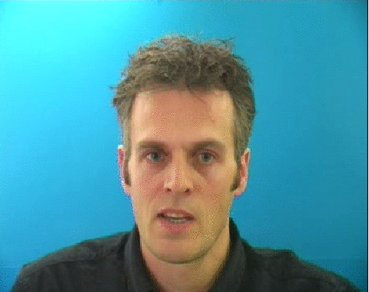

# LipNet: End-to-End Sentence-level Lipreading
Keras implementation of the method described in the paper 'LipNet: End-to-End Sentence-level Lipreading' by Yannis M. Assael, Brendan Shillingford, Shimon Whiteson, and Nando de Freitas (https://arxiv.org/abs/1611.01599).



## Results
|       Scenario          | Epoch |  CER  |  WER  |  BLEU |
|:-----------------------:|:-----:|:-----:|:-----:|:-----:|
|  Unseen speakers [C]    |  N/A  |  N/A  |  N/A  |  N/A  |
|    Unseen speakers      |  178  |  6.19%  |  14.19%  |  88.21%  |
| Overlapped speakers [C] |  N/A  |  N/A  |  N/A  |  N/A  |
|   Overlapped speakers   |  368  |  1.56%  |  3.38%  |  96.93%  |

**Notes**:

- [C] means using curriculum learning.
- N/A means either the training is in progress or haven't been performed.
- Your contribution in sharing the results of this model is highly appreciated :)

## Dependencies
* Keras 2.0+
* Tensorflow 1.0+
* PIP (for package installation)

Plus several other libraries listed on `setup.py`

## Usage
To use the model, first you need to clone the repository:
```
git clone https://github.com/rizkiarm/LipNet
```
Then you can install the package:
```
cd LipNet/
pip install -e .
```
**Note:** if you don't want to use CUDA, you need to edit the ``setup.py`` and change ``tensorflow-gpu`` to ``tensorflow``

You're done!

Here is some ideas on what you can do next:
* Modify the package and make some improvements to it.
* Train the model using predefined training scenarios.
* Make your own training scenarios.
* Use [pre-trained weights](https://github.com/rizkiarm/LipNet/tree/master/evaluation/models) to do lipreading.
* Go crazy and experiment on other dataset! by changing some hyperparameters or modify the model.

## Dataset
This model uses GRID corpus (http://spandh.dcs.shef.ac.uk/gridcorpus/)

## Pre-trained weights
For those of you who are having difficulties in training the model (or just want to see the end results), you can download and use the weights provided here: https://github.com/rizkiarm/LipNet/tree/master/evaluation/models. 

More detail on saving and loading weights can be found in [Keras FAQ](https://keras.io/getting-started/faq/#how-can-i-save-a-keras-model).

## Training
There are five different training scenarios that are (going to be) available:

### Prerequisites
1. Download all video (normal) and align from the GRID Corpus website.
2. Extracts all the videos and aligns.
3. Create ``datasets`` folder on each training scenario folder.
4. Create ``align`` folder inside the ``datasets`` folder.
5. All current ``train.py`` expect the videos to be in the form of 100x50px mouthcrop image frames.
You can change this by adding ``vtype = "face"`` and ``face_predictor_path`` (which can be found in ``evaluation/models``) in the instantiation of ``Generator`` inside the ``train.py``
6. The other way would be to extract the mouthcrop image using ``scripts/extract_mouth_batch.py`` (usage can be found inside the script).
7. Create symlink from each ``training/*/datasets/align`` to your align folder.
8. You can change the training parameters by modifying ``train.py`` inside its respective scenarios.

### Random split (Unmaintained)
Create symlink from ``training/random_split/datasets/video`` to your video dataset folder (which contains ``s*`` directory).

Train the model using the following command:
```
./train random_split [GPUs (optional)]
```

**Note:** You can change the validation split value by modifying the ``val_split`` argument inside the ``train.py``.
### Unseen speakers
Create the following folder:
* ``training/unseen_speakers/datasets/train``
* ``training/unseen_speakers/datasets/val``

Then, create symlink from ``training/unseen_speakers/datasets/[train|val]/s*`` to your selection of ``s*`` inside of the video dataset folder.

The paper used ``s1``, ``s2``, ``s20``, and ``s22`` for evaluation and the remainder for training.

Train the model using the following command:
```
./train unseen_speakers [GPUs (optional)]
```
### Unseen speakers with curriculum learning
The same way you do unseen speakers.

**Note:** You can change the curriculum by modifying the ``curriculum_rules`` method inside the ``train.py``

```
./train unseen_speakers_curriculum [GPUs (optional)]
```

### Overlapped Speakers
Run the preparation script:
```
python prepare.py [Path to video dataset] [Path to align dataset] [Number of samples]
```
**Notes:**
- ``[Path to video dataset]`` should be a folder with structure: ``/s{i}/[video]``
- ``[Path to align dataset]`` should be a folder with structure: ``/[align].align``
- ``[Number of samples]`` should be less than or equal to ``min(len(ls '/s{i}/*'))``

Then run training for each speaker:
```
python training/overlapped_speakers/train.py s{i}
```

### Overlapped Speakers with curriculum learning
Copy the ``prepare.py`` from ``overlapped_speakers`` folder to ``overlapped_speakers_curriculum`` folder, 
and run it as previously described in overlapped speakers training explanation.

Then run training for each speaker:
```
python training/overlapped_speakers_curriculum/train.py s{i}
```
**Note:** As always, you can change the curriculum by modifying the ``curriculum_rules`` method inside the ``train.py``

## Evaluation
To evaluate and visualize the trained model on a single video / image frames, you can execute the following command:
```
./predict [path to weight] [path to video]
```
**Example:**
```
./predict evaluation/models/overlapped-weights368.h5 evaluation/samples/id2_vcd_swwp2s.mpg
```
## Work in Progress
This is a work in progress. Errors are to be expected.
If you found some errors in terms of implementation please report them by submitting issue(s) or making PR(s). Thanks!

**Some todos:**
- [X] Use ~~Stanford-CTC~~ Tensorflow CTC beam search
- [X] Auto spelling correction
- [X] Overlapped speakers (and its curriculum) training
- [ ] Integrate language model for beam search
- [ ] RGB normalization over the dataset.
- [X] Validate CTC implementation in training.
- [ ] Proper documentation
- [ ] Unit tests
- [X] (Maybe) better curriculum learning.
- [ ] (Maybe) some proper scripts to do dataset stuff.

## License
MIT License
